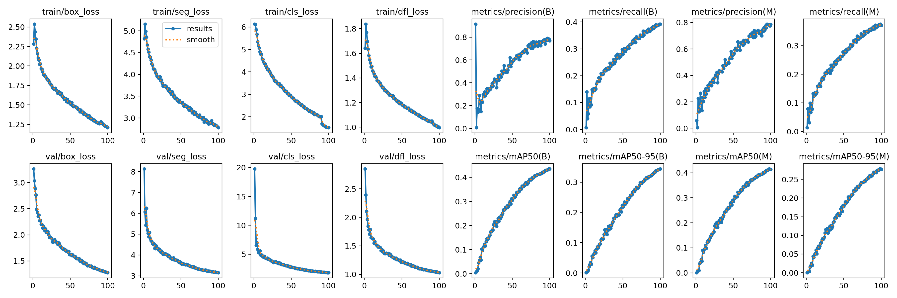
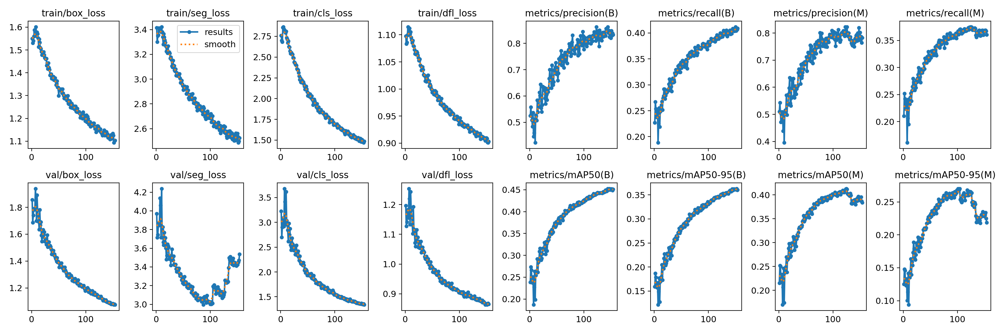
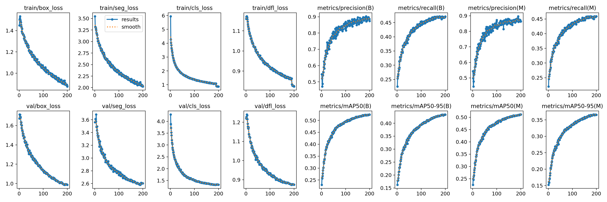
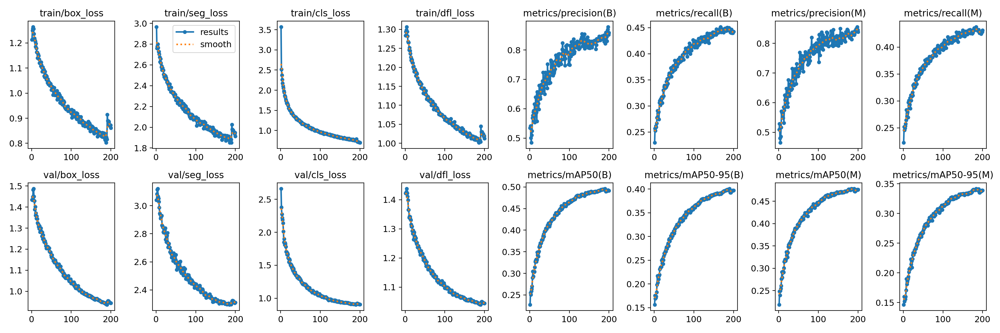
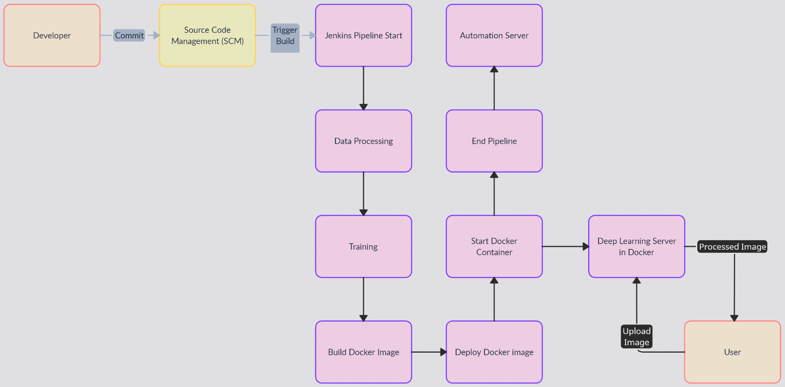
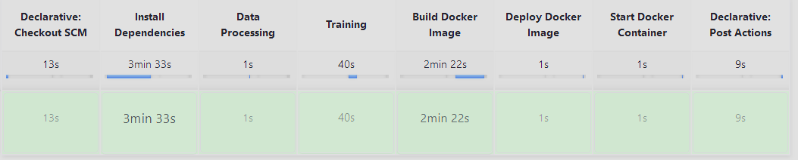
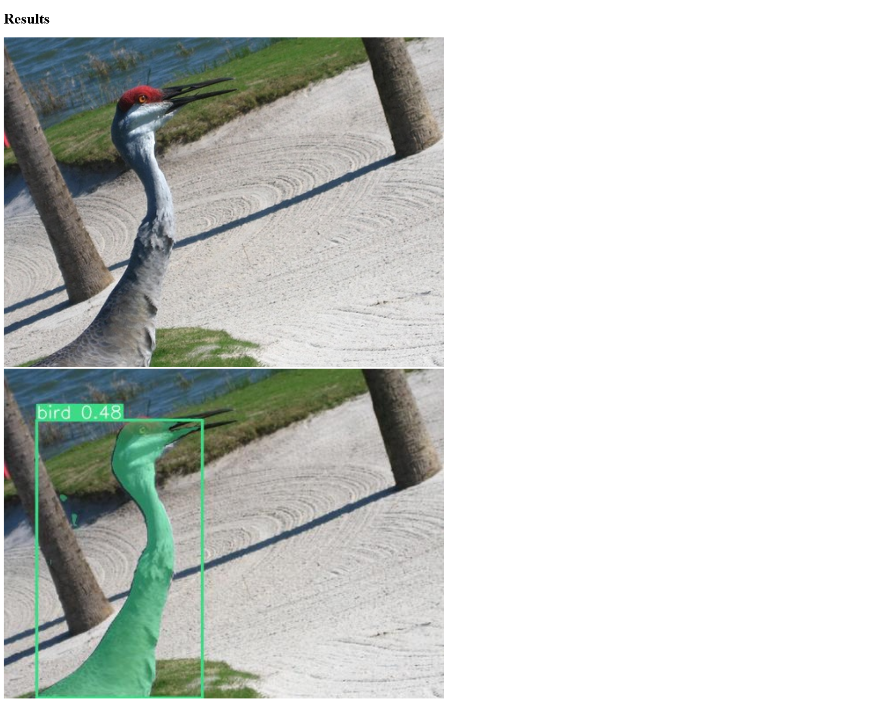

# YOLO Training with PASCAL VOC2012 Dataset

drive másolat, ha a githubos mappában valamelyik fájl nem található:  
In case some files are not available on GitHub, you can find them in this [Google Drive folder](https://drive.google.com/file/d/1CwBUp6yPpxWQpt_OEg-J85EE9bFEqPp3/view?usp=sharing).

## Dataset

[PASCAL VOC2012](https://www.kaggle.com/datasets/bardiaardakanian/voc0712).

## Structure//felépítés

- `JPEGImages`: Contains JPEG data for training.
- `SegmentationObject`: Contains PNG masks to create text annotations for training.
- `Annotations`: Contains the XML data.
- `IMGAnnotations`: created by the python code, contains the segmentation text files created from the xml and png masks.
- `runs`: Contains the training models.
- `model-name`: Contains the model results on a few hand-selected pictures.
- `onlab.ipynb`: Contains the code in a Jupyter notebook.
- `datproc.py`: Contains the data processing part of the notebook, needed for the jenkins pipeline.
- `training.py`: Contains the training part of the notebook, needed for the jenkins pipeline.
- `dockerfile`: Contains the docker image creation for python+pytorch, installs majority of requirements.
- `jenkinsfile`: Contains the jenkins pipeline.
- `requirements.txt`: Contains the python prerequisites.
## Training Results//Tanitás eredmények

The following images show the results of the training with different configurations:

- AdamW optimisation with custom learning rate and momentum:
  
- Continuing previous AdamW optimisation training with patience/early stopping=30:
  
- Auto Optimisation, default learning rate and momentum+ custom hyperparameters from tuning:
  
- Default hyperparameters:
  

The following images show the model in use (on training data, so not the best test data):


---
## Jenkins  
Jenkins in docker with docker job agents  
Used this repo/tutorial as base:  
[devopsjourney1/jenkins-101](https://github.com/devopsjourney1/jenkins-101)  
[Jenkins Docker Installation Guide](https://www.jenkins.io/doc/book/installing/docker/)

**Jenkins setup:**  

Jenkins BlueOcean docker image:  

```bash
docker build -t myjenkins-blueocean:2.414.2 .
```

Network creation:  

```bash
docker network create jenkins
```

Container start:  

```bash
docker run --name jenkins-blueocean --restart=on-failure --detach \
  --network jenkins --env DOCKER_HOST=tcp://docker:2376 \
  --env DOCKER_CERT_PATH=/certs/client --env DOCKER_TLS_VERIFY=1 \
  --volume jenkins-data:/var/jenkins_home \
  --volume jenkins-docker-certs:/certs/client:ro \
  --publish 8080:8080 --publish 50000:50000 myjenkins-blueocean:2.414.2
```

Jenkins local site:  
[https://localhost:8080/](https://localhost:8080/)

Docker proxy to host machine docker:  

```bash
docker run -d --restart=always -p 127.0.0.1:2376:2375 --network jenkins -v /var/run/docker.sock:/var/run/docker.sock alpine/socat tcp-listen:2375,fork,reuseaddr unix-connect:/var/run/docker.sock
```

Jenkins Python Agent from dockerfile:  

```bash
docker pull arminfal/onlab:latest
```  
# Jenkins Settings

- **Home directory:** `/var/jenkins_home`
- **Docker Host URI (From docker image):** `tcp://172.18.0.2:2375`

## Docker Agent

- **Name:** Docker-yolo
- **Docker image:** arminfal/onlab:latest
- **Instance Capacity:** 5

## Job Settings

- Discard old builds
- Log Rotation
- **Max # of builds to keep:** 5
- **Github project:** [https://github.com/arminfal/Onlab_YOLO_PASCAL/](https://github.com/arminfal/Onlab_YOLO_PASCAL/)
- **Poll SCM:** H * * * *
  - This means that it looks at the github repo for any commit once an hour, and if there is any change then it runs a new build.

## Pipeline

- Pipeline script from SCM
- **SCM:** Git
- **Repo URL:** [https://github.com/arminfal/Onlab_YOLO_PASCAL](https://github.com/arminfal/Onlab_YOLO_PASCAL)
- **Branches to build:** */main
- **Script path:** jenkinsfile  

# Jenkinsfile Breakdown

- **Install Dependencies**: Installs necessary packages and Python dependencies from `requirements.txt`.
- **Data Processing**: Executes `datproc.py` script for data processing.
- **Training**: Executes `training.py` script for model training.
- **Build Docker Image**: Builds a docker image from the pipeline results.
- **Deploy Docker Deploy**: Tags and pushes the docker image to dockerhub(curently disabled to speed up developing).
- **Start Docker Container**: Starts the docker container, which will run on the docker server even after the job itself stops.  
The prediction uses a pretrained model, because the jenkins pipeline only runs a very short training, which has no real detection, it would need to run at least several hours on a GPU to give any results.  
After execution, it archives all artifacts in the 'runs' directory.  
# CI/CD pipeline diagram  

# Pipeline  

# Created Website  

